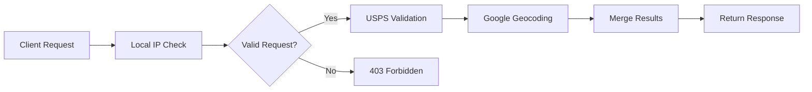

# CandyComp Location Correction Service

[](https://www.typescriptlang.org/)
[](https://nodejs.org/)
[](https://opensource.org/licenses/MIT)
[](https://expressjs.com/)

A high-performance address validation and geocoding service that combines USPS address standardization with Google Maps geocoding to provide accurate, normalized location data for real estate applications.

## 🌟 Key Features

- **🏠 USPS Address Validation**: Standardizes addresses using official USPS data
- **📍 Google Maps Geocoding**: Forward and reverse geocoding with high accuracy
- **🔄 Dual Validation**: Combines both services for maximum accuracy
- **💾 Token Caching**: Efficient USPS OAuth token management
- **🛡️ Local-Only Access**: Secure by default with IP restrictions
- **⚡ High Performance**: Optimized for low latency
- **🎯 Real Estate Focused**: Designed for property listing applications

## 📋 Table of Contents

- [Installation](#installation)
- [Quick Start](#quick-start)
- [API Documentation](#api-documentation)
- [Configuration](#configuration)
- [Architecture](#architecture)
- [Development](#development)
- [Testing](#testing)
- [Deployment](#deployment)
- [Contributing](#contributing)
- [License](#license)

## 🚀 Installation

### Prerequisites

- Node.js >= 18.0.0
- npm or yarn
- USPS Web Tools API credentials
- Google Maps API key

### Setup

1. **Clone the repository:**
```bash
git clone https://github.com/Wal33D/candycomp-location-correction.git
cd candycomp-location-correction
```

2. **Install dependencies:**
```bash
npm install
```

3. **Configure environment variables:**
```bash
cp .env.example .env
# Edit .env with your API credentials
```

4. **Build the project:**
```bash
npm run build
```

5. **Start the server:**
```bash
npm start
```

The server will start on port 3715 by default.

## ⚡ Quick Start

```bash
# Development mode with hot reload
npm run dev

# Production mode
npm start

# Run with PM2
pm2 start ecosystem.config.js
```

### Example Request

```bash
curl -X POST http://localhost:3715/validate-location \
  -H "Content-Type: application/json" \
  -d '{
    "streetAddress": "1600 Pennsylvania Avenue",
    "city": "Washington",
    "state": "DC",
    "zipCode": "20500"
  }'
```

### Example Response

```json
{
  "streetAddress": "1600 Pennsylvania Ave NW",
  "city": "Washington",
  "state": "DC",
  "zipCode": "20500",
  "formattedAddress": "1600 Pennsylvania Ave NW, Washington, DC 20500",
  "geo": {
    "type": "Point",
    "coordinates": [-77.0365, 38.8977]
  },
  "county": "District Of Columbia",
  "status": true
}
```

## 📚 API Documentation

### Interactive API Documentation
Open `api-docs.html` in your browser for interactive API documentation powered by Swagger UI. You can also view the raw OpenAPI specification in `openapi.yaml`.

### Base URL
```
http://localhost:3715
```

### Authentication
All endpoints require requests to originate from localhost (127.0.0.1 or ::1).

### Endpoints

#### Health Check
**`GET /health`** - Check the API health and status

**Response:**
```json
{
  "status": "ok",
  "timestamp": "2025-01-30T12:00:00.000Z",
  "uptime": 123.456,
  "environment": "development",
  "cache": {
    "size": 42,
    "capacity": 1000,
    "utilization": 4.2
  }
}
```

#### Validate Single Location
**`POST /validate-location`** - Validates and corrects a single address

**Request Body:**
```json
{
  "streetAddress": "1600 Pennsylvania Avenue",  // Required
  "city": "Washington",                        // Required if no zipCode
  "state": "DC",                               // Optional (2-letter code)
  "zipCode": "20500",                          // Required if no city
  "geo": {                                     // Optional
    "type": "Point",
    "coordinates": [-77.0365, 38.8977]
  },
  "formattedAddress": "...",                   // Optional
  "county": "...",                             // Optional
  "latitude": 38.8977,                         // Optional (alternative to geo)
  "longitude": -77.0365                        // Optional (alternative to geo)
}
```

**Success Response:**
```json
{
  "streetAddress": "1600 Pennsylvania Ave NW",
  "city": "Washington",
  "state": "DC",
  "zipCode": "20500",
  "formattedAddress": "1600 Pennsylvania Ave NW, Washington, DC 20500",
  "unformattedAddress": "1600 Pennsylvania Avenue, Washington, DC, 20500",
  "geo": {
    "type": "Point",
    "coordinates": [-77.0365, 38.8977]
  },
  "county": "District Of Columbia",
  "streetName": "Pennsylvania Ave NW",
  "status": true
}
```

**Error Response:**
```json
{
  "streetAddress": "123 Invalid St",
  "city": "Unknown",
  "formattedAddress": "",
  "status": false,
  "error": "USPS address validation failed"
}
```

#### Batch Location Validation
**`POST /validate-locations`** - Validate multiple locations (max 100)

**Request Body:**
```json
{
  "locations": [
    {
      "streetAddress": "1600 Pennsylvania Avenue",
      "city": "Washington",
      "state": "DC"
    },
    {
      "streetAddress": "350 5th Ave",
      "city": "New York",
      "state": "NY",
      "zipCode": "10118"
    }
  ]
}
```

**Response:**
```json
{
  "count": 2,
  "results": [
    {
      "index": 0,
      "streetAddress": "1600 Pennsylvania Ave NW",
      "city": "Washington",
      "state": "DC",
      "zipCode": "20500",
      "formattedAddress": "1600 Pennsylvania Ave NW, Washington, DC 20500",
      "geo": {
        "type": "Point",
        "coordinates": [-77.0365, 38.8977]
      },
      "status": true
    },
    {
      "index": 1,
      "streetAddress": "350 5th Ave",
      "city": "New York",
      "state": "NY",
      "zipCode": "10118",
      "formattedAddress": "350 5th Ave, New York, NY 10118",
      "geo": {
        "type": "Point",
        "coordinates": [-73.9851, 40.7484]
      },
      "status": true
    }
  ]
}
```

#### Cache Statistics
**`GET /cache/stats`** - Get geocoding cache statistics

**Response:**
```json
{
  "geocoding": {
    "size": 42,
    "capacity": 1000,
    "utilization": 4.2
  },
  "cleanedExpired": 3
}
```

### Error Codes

| Status Code | Description |
|-------------|-------------|
| 200 | Success |
| 400 | Bad Request - Invalid input data |
| 403 | Forbidden - Request not from localhost |
| 429 | Too Many Requests - Rate limit exceeded |
| 500 | Internal Server Error |
| 502 | Bad Gateway - External API error |
| 504 | Gateway Timeout - External API timeout |

### Rate Limiting
- Default: 100 requests per minute
- Configurable via environment variables
- Local requests bypass rate limiting

### Response Headers
- `Cache-Control: public, max-age=86400` - 24-hour cache
- `X-Cache-Status: hit|miss` - Indicates if result was from cache
- Standard security headers via Helmet (in production)

## ⚙️ Configuration

### Environment Variables

Create a `.env` file based on `.env.example`:

| Variable | Description | Required | Default |
|----------|-------------|----------|---------|
| `USPS_TOKEN_URL` | USPS OAuth token endpoint | Yes | - |
| `USPS_ADDRESS_URL` | USPS address validation endpoint | Yes | - |
| `USPS_CONSUMER_KEY` | USPS API consumer key | Yes | - |
| `USPS_CONSUMER_SECRET` | USPS API consumer secret | Yes | - |
| `GMAPS_API_KEY` | Google Maps API key | Yes | - |
| `PORT` | Server port | No | 3715 |
| `NODE_ENV` | Environment mode | No | development |

### Obtaining API Credentials

#### USPS Web Tools API
1. Register at [USPS Web Tools](https://www.usps.com/business/web-tools-apis/)
2. Request access to the Address API
3. Use provided consumer key and secret

#### Google Maps API
1. Visit [Google Cloud Console](https://console.cloud.google.com/)
2. Enable Geocoding API
3. Create API key with appropriate restrictions

## 🏗️ Architecture

### Service Flow



### Key Components

1. **USPS Integration**
   - OAuth 2.0 token management with caching
   - Address standardization API
   - Automatic token refresh

2. **Google Maps Integration**
   - Forward geocoding (address to coordinates)
   - Reverse geocoding (coordinates to address)
   - Component parsing for detailed location data

3. **Data Processing**
   - Title case formatting
   - County name normalization
   - Address component extraction

## 💻 Development

### Project Structure

```
location-correction/
├── src/
│   ├── server.ts              # Main server file
│   ├── types.ts               # TypeScript definitions
│   └── middleware/
│       └── localOnlyMiddleware.ts  # IP restriction
├── dist/                      # Compiled JavaScript
├── ecosystem.config.js        # PM2 configuration
├── tsconfig.json             # TypeScript configuration
└── package.json
```

### Scripts

```bash
# Development
npm run dev          # Start with hot reload
npm run build        # Compile TypeScript

# Testing
npm test             # Run tests (when implemented)

# Production
npm start            # Start server
```

### Code Style

The project uses Prettier for code formatting with the following configuration:
- Tab width: 4
- Use tabs: true
- Single quotes
- Trailing commas (ES5)
- Print width: 150

## 🧪 Testing

### Running Tests

```bash
# Capture baseline API responses
npx ts-node baseline-api-tests.ts

# Measure memory usage
node measure-memory.js
```

### Test Coverage

The baseline tests cover:
- Health check endpoint
- Complete address validation
- Minimal address validation
- Reverse geocoding
- Error handling

## 🚀 Deployment

### Using PM2

```bash
# Start with PM2
pm2 start ecosystem.config.js

# Monitor
pm2 monit

# View logs
pm2 logs candycomp-location-correction

# Restart
pm2 restart candycomp-location-correction

# Stop
pm2 stop candycomp-location-correction
```

### Docker (Coming Soon)

Docker support is planned for future releases.

### System Requirements

- **Memory**: ~50MB baseline
- **CPU**: Minimal
- **Network**: Outbound HTTPS to USPS and Google APIs

## 🤝 Contributing

Contributions are welcome! Please see [CONTRIBUTING.md](CONTRIBUTING.md) for guidelines.

### Development Workflow

1. Fork the repository
2. Create a feature branch
3. Make your changes
4. Add tests
5. Submit a pull request

## 📄 License

This project is licensed under the MIT License - see the [LICENSE](LICENSE) file for details.

## 🙏 Acknowledgments

- USPS for providing address validation services
- Google Maps for geocoding capabilities
- The CandyComp team for project direction

## 📞 Support

For issues, questions, or contributions:
- GitHub Issues: [github.com/Wal33D/candycomp-location-correction/issues](https://github.com/Wal33D/candycomp-location-correction/issues)
- Email: waleed@glitchgaming.us

---

Made with ❤️ by [Waleed Judah](https://github.com/Wal33D)